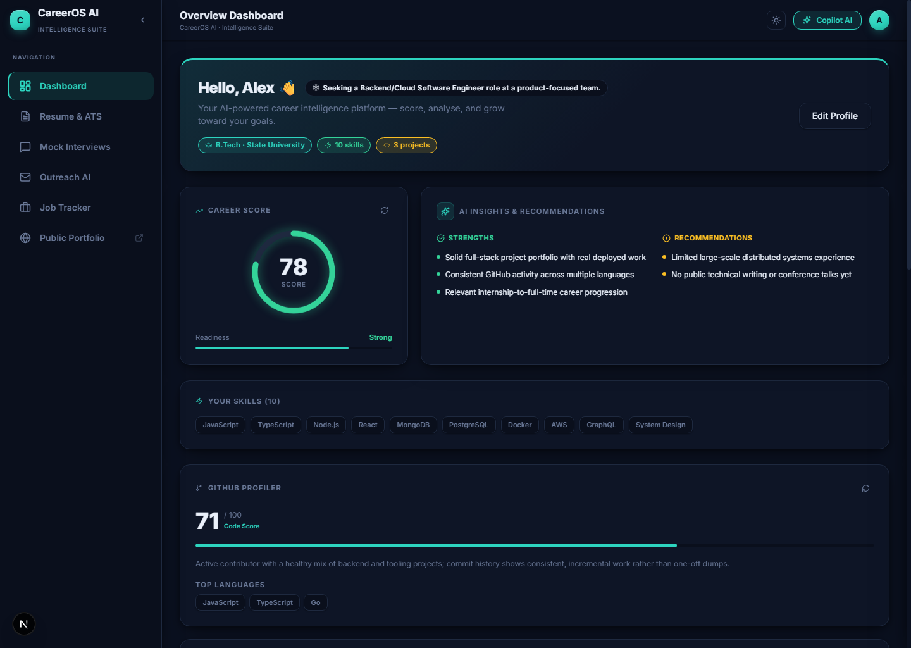
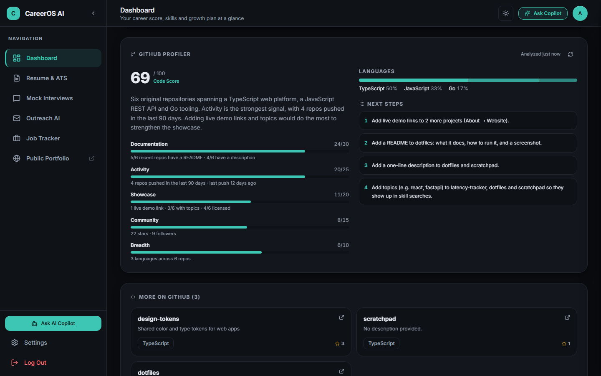
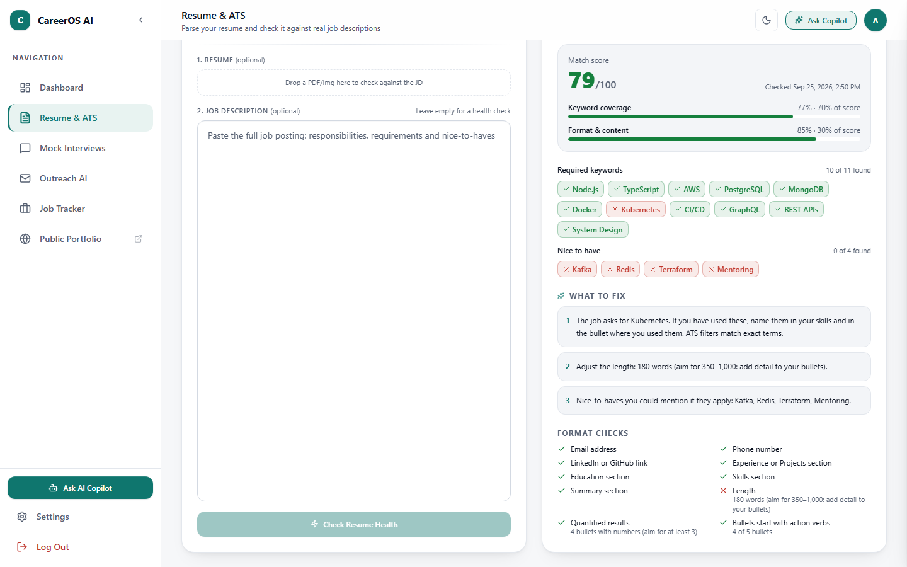
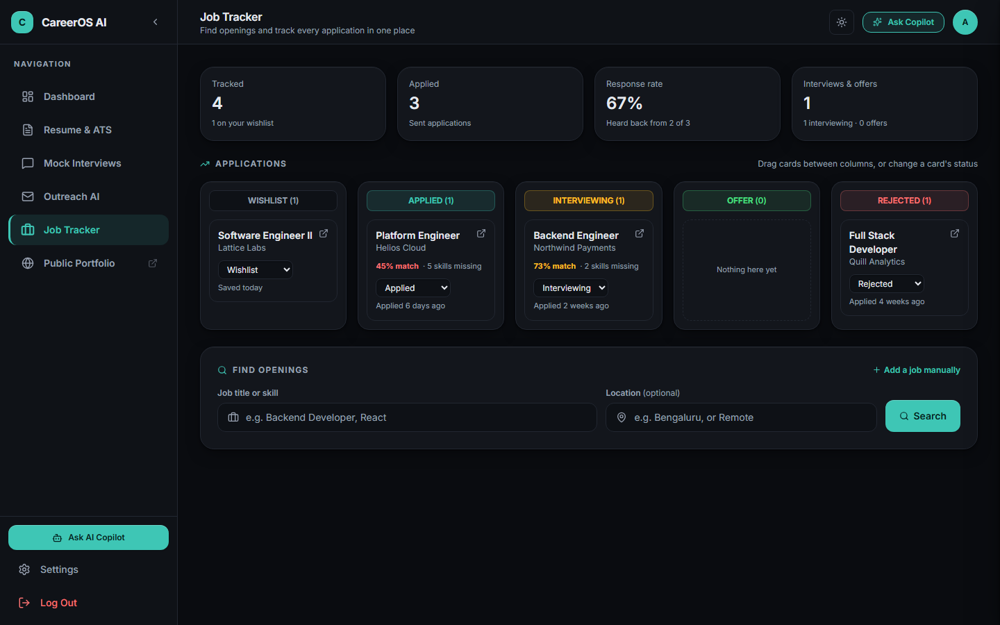
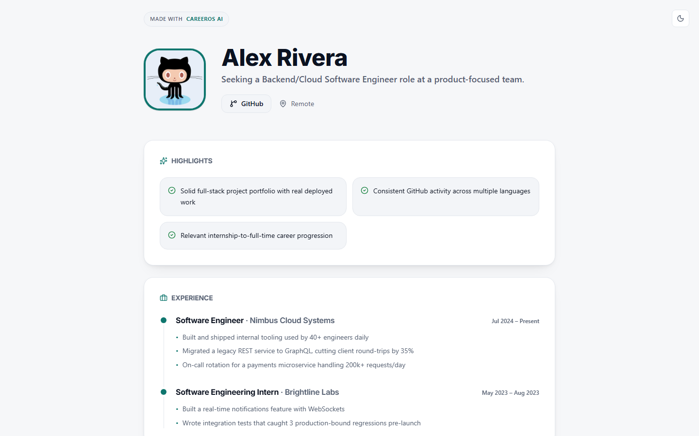
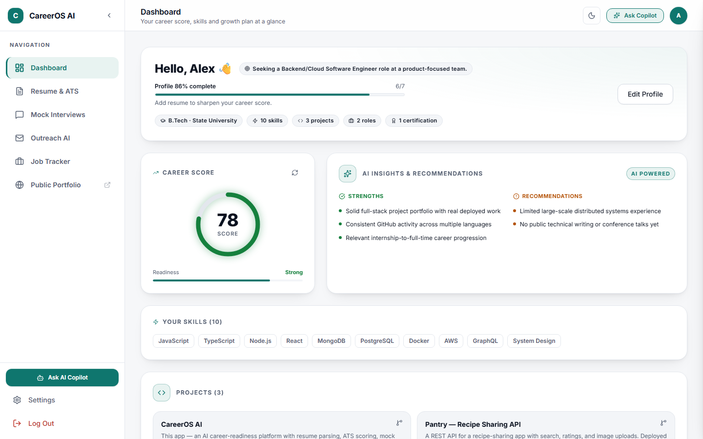
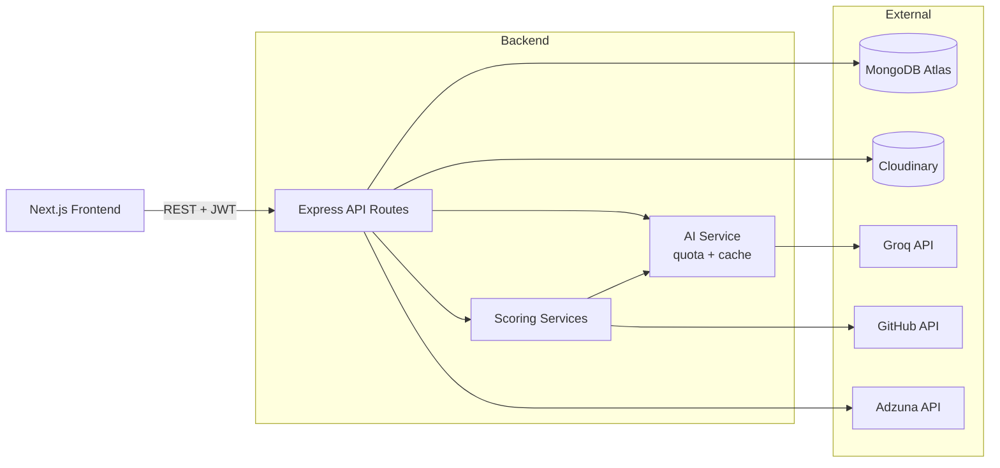

<div align="center">

# CareerOS AI

**A career-readiness platform that tells you exactly what to fix, and shows its working.**

[](LICENSE)
[](https://github.com/Rishabh893-ux/CareerOS-AI/actions/workflows/ci.yml)
[](https://nextjs.org/)
[](https://nodejs.org/)
[](https://www.mongodb.com/atlas)
[](https://careeros-ai-phi.vercel.app)

[Live demo](https://careeros-ai-phi.vercel.app) · [Features](#features) · [How the scores work](#how-the-scores-work) · [Getting started](#getting-started) · [Architecture](#architecture)

<br/>



</div>

<br/>

CareerOS AI brings a job seeker's whole search into one place: profile, resume, GitHub, mock interviews, outreach, job applications and a public portfolio. Each tool gives feedback you can act on. The ATS check lists the exact keywords a job asks for that your resume doesn't mention. The GitHub analyzer names the repos missing a README. The job tracker shows which required skills you're missing for each application.

**Scores are measured, not guessed.** Wherever a number appears, it's computed from signals the app can verify, such as keywords found in your resume or READMEs present on GitHub. AI is used for what it's good at: reading a job description, writing a summary, drafting a message. It's never used to invent a score.

> **Try it without signing up:** open the [live demo](https://careeros-ai-phi.vercel.app) and choose **Try the Demo**. You'll explore a sample profile, "Alex Rivera", with tracked jobs, a GitHub analysis and a portfolio.

---

## Contents

- [Features](#features)
- [How the scores work](#how-the-scores-work)
- [Screenshots](#screenshots)
- [Tech stack](#tech-stack)
- [Architecture](#architecture)
- [Getting started](#getting-started)
- [Testing](#testing)
- [Project structure](#project-structure)
- [Design and accessibility](#design-and-accessibility)
- [AI quota guardrails](#ai-quota-guardrails)
- [Deployment notes](#deployment-notes)
- [Roadmap](#roadmap)
- [Contributing](#contributing)
- [License](#license)

---

## Features

### Dashboard and profile
- **Career score (0–100):** readiness from a fixed, explainable weighting across skills, projects and GitHub activity.
- **Profile completeness:** a progress bar that names what to add next ("Add GitHub to sharpen your career score").
- **Growth roadmap and skill gap:** enter a target role to get the missing skills, a step-by-step learning plan and a career-path ladder with realistic year ranges.
- **Profile editor:** labelled forms for goal, skills (including those pulled from your resume), education and projects.

### GitHub analyzer
- **Measured score:** built from five signals (documentation, activity, showcase, community, breadth), each with the detail behind it, such as "5/6 recent repos have a README".
- **Real README checks:** the most recently active repos are checked through the GitHub API.
- **Next steps that name your repos,** for example "Add a README to `dotfiles`…", ordered by how many points they're worth.
- **No repeats:** projects link to their matching repositories, and "More on GitHub" lists only the repos that aren't already a project.

### Resume and ATS
- **Resume parser:** PDF or image upload with three-tier text extraction (`pdf-parse` → `pdfjs-dist` text layer → Groq Vision OCR), so scanned resumes work too.
- **ATS match:** paste a job description and the AI extracts its required and nice-to-have keywords. Each one is then checked against your **full** resume text, with aliases (`k8s` → Kubernetes, `RESTful` → REST API) and guards against false matches ("next steps" isn't Next.js).
- **Resume health:** with no job description, ten format checks run with no AI call: contact details, standard section headings, length, bullets with numbers and bullets that start with action verbs.
- **What an ATS actually sees:** the raw extracted text, so you can spot columns or icons that break parsing.
- **Resume builder and cover letters:** two ATS-friendly templates that auto-fit to one page, plus a cover letter generator grounded only in your real experience.

### Job tracker
- **Kanban board** (Wishlist → Applied → Interviewing → Offer → Rejected), with drag-and-drop **and** a status menu on every card, so it works on phones and with a keyboard.
- **Pipeline summary:** tracked, applied, response rate, and interviews and offers.
- **Job detail dialog:** edit notes, dates, the posting link and the job description. The applied date fills in automatically.
- **Keyword-based match:** the same matcher as the ATS check shows which skills you have and which you're missing, and it re-runs when the description changes.
- **Live search:** real openings from Adzuna with formatted salaries. The same posting can't be tracked twice, and sample listings are clearly labelled when live search is unavailable.

### Mock interviews
- **Written or MCQ** sessions of 5, 10 or 20 questions, technical or HR. MCQs are graded in code; written answers get AI feedback.
- **Interview journal:** past sessions are saved with feedback and areas to improve.

### Outreach and research
- **Networking assistant:** personalized cold emails and LinkedIn messages drafted from your real profile.
- **Company research brief:** talking points and smart questions, with a "verify before you go" list. The prompt is written to never invent funding figures, executive names or news.

### AI Copilot
- **A chat drawer** that answers from your own saved data (roadmap, applications, scores). It never runs a fresh analysis itself; if something hasn't been computed yet, it tells you what to run first.

### Public portfolio
- **A shareable page** at `/p/<username>` with your highlights, experience, projects, skills, open-source work, education and certifications. Your internal scores are **never** shown publicly.

---

## How the scores work

| Score | Built from | AI's role |
|---|---|---|
| **ATS match** | 70% keyword coverage (required keywords count double) + 30% format checks | Extracts keywords from the job description only |
| **Resume health** | 10 weighted format checks | None |
| **GitHub** | Documentation 30 · Activity 25 · Showcase 20 · Community 15 · Breadth 10 | Writes a 2–3 sentence summary from the measured facts |
| **Job match** | Keyword coverage of the job's keywords in your resume | Extracts keywords from the job description only |
| **Career score** | Fixed weighting across skills/projects, GitHub activity and goal alignment | Fills in the assessment within that weighting |

If the AI is unavailable, keyword extraction falls back to a built-in list of well-known skills, and the report says so.

---

## Screenshots

<table>
  <tr>
    <td width="50%"></td>
    <td width="50%"></td>
  </tr>
  <tr>
    <td><b>GitHub analyzer:</b> a score you can trace back to its signals, plus fixes that name the repos.</td>
    <td><b>ATS report:</b> every ✓ and ✗ is checked against the full resume text.</td>
  </tr>
  <tr>
    <td></td>
    <td></td>
  </tr>
  <tr>
    <td><b>Job tracker:</b> pipeline summary, a status menu on every card and a per-job match.</td>
    <td><b>Public portfolio:</b> the link you'd send a recruiter.</td>
  </tr>
  <tr>
    <td colspan="2"></td>
  </tr>
  <tr>
    <td colspan="2"><b>Light and dark themes:</b> both follow your system setting, and you can switch at any time.</td>
  </tr>
</table>

All screenshots show the built-in demo account.

---

## Tech stack

| Layer | Technology |
|---|---|
| **Frontend** | Next.js 16 (App Router), React 19, TypeScript, Tailwind CSS 4, Lucide icons |
| **Backend** | Node.js 20+, Express, Mongoose, Multer |
| **Database** | MongoDB Atlas |
| **AI** | [Groq](https://groq.com/): `openai/gpt-oss-120b` for text, `qwen/qwen3.8-27b` for vision OCR on scanned resumes |
| **File storage** | Cloudinary (resume files) |
| **External APIs** | GitHub REST API, Adzuna job search |
| **Testing and CI** | Node's built-in test runner, GitHub Actions (lint, typecheck, build, tests) |

---

## Architecture



- **Every AI call goes through one service** (`aiService.js`), where the rate limiting, daily quota and cache fallback live.
- **Scoring is pure and tested:** `atsAnalyzer.js` and `githubScoring.js` take data in and return scores, with no I/O. That's what makes them repeatable and easy to test.
- **Resume files live in Cloudinary;** only the URL and the extracted text are stored in MongoDB.

### API reference

All routes are under `/api`. Everything except registration, login, password reset, the demo and public portfolios needs a `Bearer` token.

| Module | Endpoints | What it does |
|---|---|---|
| **Auth** `/auth` | `POST /register` `POST /login` `POST /demo` `GET /me` `PUT /settings` `POST /forgot-password` `POST /reset-password` | JWT auth, partial settings updates (username, GitHub and LinkedIn links) and a shared demo account |
| **Profile** `/profile` | `GET /` `PUT /` `GET /public/:username` | Education, projects, skills and career goal; public portfolio by username or account ID (merged skills, never private scores) |
| **Resume** `/resume` | `POST /upload` `DELETE /` `POST /ats-check` `POST /enhance-bullet` `POST /cover-letter` | Upload and parse, ATS match or health check, bullet rewriting and cover letters |
| **GitHub** `/github` | `GET /analyze` | Measured score, signals, next steps and repos (cached; `?refresh=true` recomputes) |
| **Career** `/career` | `GET /score` | The 0–100 career readiness score (cached) |
| **Growth** `/growth` | `POST /skill-gap` `POST /roadmap` `POST /career-path` | Missing skills, learning roadmap and career ladder for a target role, cached per role |
| **Interview** `/interview` | `POST /generate` `POST /:id/feedback` `GET /` `DELETE /:id` | Generates sessions, scores answers and keeps the journal |
| **Jobs** `/jobs` | `GET /` `POST /` `PUT /:id` `DELETE /:id` `POST /:id/analyze` `GET /search` | Kanban tracker, keyword match (re-run on demand) and Adzuna search |
| **Outreach** `/outreach` | `POST /generate` `POST /research` | Networking messages and company research briefs |
| **Copilot** `/copilot` | `POST /ask` | Chat answers from the user's saved data |

### Resume text extraction

`POST /api/resume/upload` extracts text server-side in three tiers, so both native-text and scanned resumes work:
1. **`pdf-parse`**, the fast path for PDFs with a real text layer.
2. **`pdfjs-dist`'s own text-layer API**, which recovers text from PDFs that trip up `pdf-parse`, without any rendering.
3. **Rasterize and OCR with Groq Vision**, only for genuinely scanned PDFs (pages rendered with `pdfjs-dist` + `@napi-rs/canvas`).

Image uploads go straight to Groq Vision. Only one `pdfjs-dist` version is loaded per process, because its Node worker caches itself globally and a second copy causes version-mismatch crashes.

### Design decisions

- **MongoDB:** profile data is nested and varies per user, so a document model avoids join-table sprawl, and Atlas M0 is free.
- **Deterministic scoring:** an AI-generated number changes on every run and can't explain itself. Measured signals are repeatable, testable and actionable.
- **The Copilot never runs fresh analysis:** it reads cached data only and tells you what to run first, keeping it at one AI call per message.
- **The roadmap reuses skill-gap data** for the same target role instead of deriving it again.

---

## Getting started

### Prerequisites
- Node.js **20 or later** and npm
- A MongoDB connection string (a free Atlas M0 cluster works)
- A [Groq API key](https://console.groq.com/keys)
- Optional: a GitHub token (raises the rate limit), Cloudinary (resume uploads), Adzuna (live job search) and an SMTP account (password-reset emails)

### 1. Backend (`/careeros`)
```bash
cd careeros
npm install
cp .env.example .env    # then fill in your keys
npm run dev             # http://localhost:5001
```

| Variable | Required | Purpose |
|---|---|---|
| `MONGO_URI` | Yes | MongoDB connection string |
| `JWT_SECRET` | Yes | Long random string for signing sessions |
| `GROQ_API_KEY` | Yes | AI features |
| `PORT` | No | Defaults to `5001` |
| `FRONTEND_URL` | No | Used in password-reset links (default setup: `http://localhost:3000`) |
| `GITHUB_TOKEN` | No | Raises GitHub's rate limit from 60 to 5,000 requests an hour |
| `CLOUDINARY_CLOUD_NAME`, `CLOUDINARY_API_KEY`, `CLOUDINARY_API_SECRET` | For uploads | Resume file storage |
| `ADZUNA_APP_ID`, `ADZUNA_API_KEY` | No | Live job search; without them, search shows labelled sample listings |
| `SMTP_EMAIL`, `SMTP_PASSWORD` | No | Sends password-reset emails; without them, the reset link is logged to the console |
| `AI_DAILY_LIMIT`, `AI_CACHE_TTL_HOURS` | No | Quota guardrails (defaults `1400` and `24`) |

### 2. Frontend (`/frontend`)
```bash
cd frontend
npm install
npm run dev             # http://localhost:3000
```

The client calls `http://localhost:5001/api` by default. To point it elsewhere, set `NEXT_PUBLIC_API_URL` in `frontend/.env.local`.

### 3. Open the app
Go to [http://localhost:3000](http://localhost:3000) and register, or choose **Try the Demo**.

---

## Testing

```bash
cd careeros && npm test        # backend: node:test, no database or network needed
cd frontend && npm run lint && npx tsc --noEmit && npm run build
```

The backend tests stub the database models and run each route on a random port, so they need no MongoDB or network access. They cover:
- **Auth:** email case handling, deleted accounts and partial settings updates
- **GitHub scoring:** repeatability, and recommendations that name the right repos
- **ATS analyzer:** aliases, false-positive guards, full-text matching and format checks
- **Job tracker routes:** duplicate tracking, applied dates, re-matching and salary formatting

CI runs all of the above on every push and pull request to `main`.

---

## Project structure

```
careeros/                 Express API
├── routes/               auth, profile, resume, github, career, growth, interview, jobs, outreach, copilot
├── services/             aiService, atsAnalyzer, githubScoring, githubService, jobKeywords,
│                         jobMatchService, resumeTextExtractor, profileUtils, cacheUtils
├── models/               User, Profile, JobApplication, InterviewSession, UsageLog
├── scripts/              one-off maintenance scripts
└── test/                 node:test suites

frontend/src/             Next.js app
├── app/                  routes: dashboard, resume (+ builder), interview, outreach, jobs, p/[username], auth pages
├── components/           feature folders (dashboard, resume, jobs, interview, portfolio, layout)
├── lib/                  api client, theme, dialog, skills and project-repo helpers
└── types/                shared TypeScript types
```

---

## Design and accessibility

- **Two themes, one brand.** Light "Porcelain" and dark "Graphite" share one teal accent. Components read design tokens (`--card-*`, `--btn-*`, `--field-*`, `--chrome-*`), so each style is written once and each theme only supplies values.
- **Contrast:** all text meets WCAG AA in both themes, and there are firmer values when the OS asks for increased contrast.
- **Follows your system:** it matches your light or dark setting and honors Reduce Motion.
- **Keyboard and screen readers:** a visible focus ring, labelled icon buttons and form fields, and dialogs that close with Escape and manage focus. Drag-and-drop always has a non-drag alternative.
- **Phones:** below tablet width, the sidebar becomes a slide-in menu.

---

## AI quota guardrails

To stay within a free-tier Groq key:
1. **Daily quota** (`UsageLog` collection): calls stop once `AI_DAILY_LIMIT` is reached, and cached or fallback data is served instead of an error.
2. **Rate limiting:** an in-memory token bucket allows at most 10 calls a minute.
3. **Caching:** the GitHub analysis and career score are cached on the profile for `AI_CACHE_TTL_HOURS` (default 24h), unless you refresh.
4. **No AI where it isn't needed:** resume health checks, all score calculations and MCQ grading run in code.

---

## Deployment notes

- **Frontend:** Vercel. Set `NEXT_PUBLIC_API_URL` to your backend URL.
- **Backend:** any Node 20+ host. Set the variables listed above and point `FRONTEND_URL` at the deployed frontend.
- **Upgrading an existing database:** earlier versions stored career goals as `"Objective: …"`. Run this once from `careeros/` (without `--apply` it only reports what it would change):
  ```bash
  node scripts/strip-objective-prefix.js --apply
  ```
- **Refreshing the demo account:** the demo's sample data is only created the first time someone opens it. To pick up new sample data on an existing database, delete the `demo@careeros.ai` user along with its profile and job applications; it's recreated on the next **Try the Demo**.

---

## Roadmap

- [ ] Edit experience and certifications directly in the profile editor
- [ ] Request validation (e.g. `zod`) on every route
- [ ] Frontend component tests
- [ ] Remember the pasted job description alongside the saved ATS result

---

## Contributing

Contributions are welcome. Open an issue for bugs or ideas, or send a pull request:
1. Fork the repo and create a branch from `main`.
2. Make your change and add tests for backend logic.
3. Run the checks in [Testing](#testing).
4. Open a pull request describing what changed and why.

## License

Released under the [MIT License](LICENSE).

---

<div align="center">

Built by **[Rishabh Kasaudhan](https://github.com/Rishabh893-ux)**

</div>
