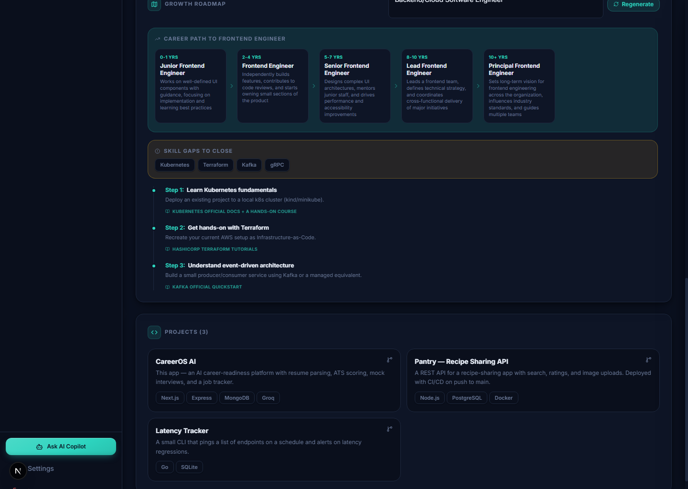
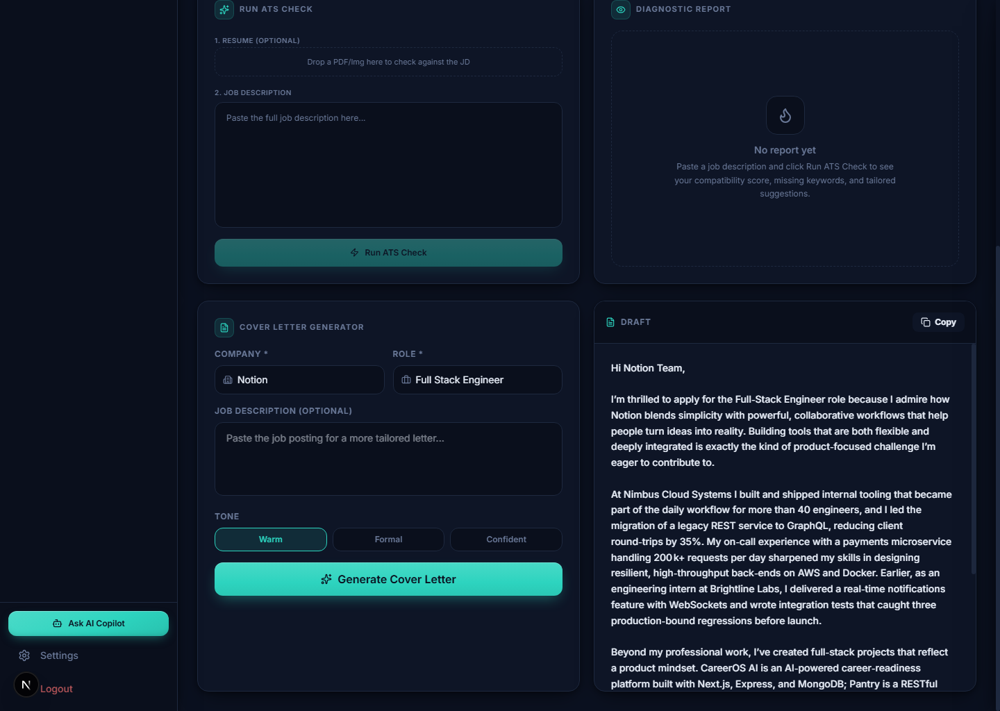
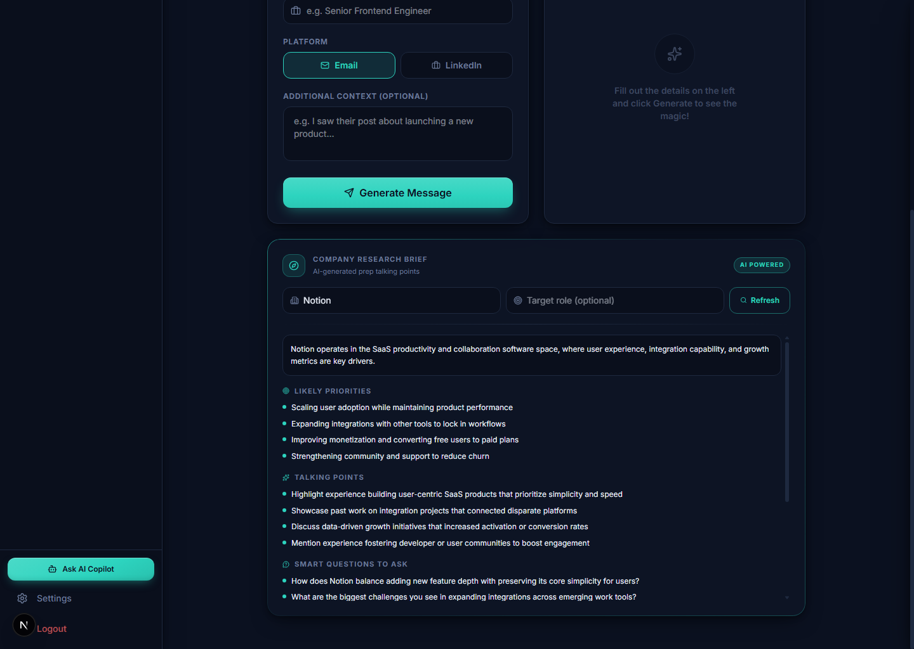

<div align="center">
  
  # 🚀 CareerOS AI
  **AI-Powered Career Readiness Platform**
  
  [](https://opensource.org/licenses/MIT)
  [](https://github.com/Rishabh893-ux/CareerOS-AI/actions/workflows/ci.yml)
  [](https://nextjs.org/)
  [](https://nodejs.org/)
  [](https://careeros-ai-phi.vercel.app)

</div>

<br/>

**CareerOS AI** is a full-stack career development platform for students and job seekers. It aggregates a candidate's profile (skills, projects, education, GitHub activity), automates resume parsing and ATS scoring against real job descriptions, runs AI-generated mock interviews (written or MCQ), tracks live job applications end-to-end, and publishes a shareable public portfolio page. It also drafts cover letters and company research briefs, and maps out a skill-gap roadmap and career-path ladder toward any target role — all grounded in the candidate's actual data, never fabricated.

**🔗 Live demo:** [careeros-ai-phi.vercel.app](https://careeros-ai-phi.vercel.app)

---

## 🛠️ Technology Stack & Architecture

*   **Frontend**: Next.js 16 (App Router), React 19, Tailwind CSS 4, Lucide icons.
*   **Backend**: Node.js, Express, Multer (file uploads), Mongoose (ODM).
*   **Database**: MongoDB Atlas.
*   **File Storage**: Cloudinary (resume PDF/image hosting).
*   **External Feeds**: GitHub REST API (code activity summaries) & Adzuna API (live job vacancies).
*   **AI Engine**: [Groq](https://groq.com/) — `openai/gpt-oss-120b` for text generation (resume parsing, career scoring, interview generation, outreach drafting) and `qwen/qwen3.8-27b` for vision-based OCR on scanned resume uploads.

### 📊 Data Flow Diagram

```
[ Next.js 16 Client ] <==== (JSON / REST APIs) ====> [ Express Backend ]
                                                            ||
     =======================================================||=======================
     ||                     ||                     ||                      ||
[ MongoDB Atlas ]     [ Cloudinary ]         [ Groq API ]           [ Adzuna / GitHub APIs ]
  (Profile/Jobs)       (PDF Storage)     (Parsing/Scoring/OCR)         (External Feeds)
```

---

## 🔑 Core Features & Modules

### 🧑‍💻 1. Unified Dashboard & Profiler
*   **Career Score**: Computes a career readiness score (0–100) from a fixed, explainable weighting across skills/projects and GitHub activity — the AI fills in the assessment within that weighting, it doesn't invent the formula.
*   **AI Recommendations**: Strengths and improvement suggestions based on the candidate's actual profile and GitHub activity.
*   **Growth Roadmap & Skill Gap Analysis**: Enter a target role to get a missing-skills breakdown and a step-by-step learning roadmap with resource hints.
*   **Career Path Ladder**: A visual title-progression ladder (e.g. Junior → Senior → Staff) toward the target role, with realistic year ranges and what changes in scope/ownership at each level.
*   **Onboarding**: Structured forms for education, projects, target role, and linked accounts (GitHub/LinkedIn).

### 📄 2. Resume Parser, Builder & ATS Suite
*   **Resume Parser**: Upload a PDF or image resume. Text extraction falls back through three tiers — `pdf-parse`, then `pdfjs-dist`'s own text layer, then Groq Vision OCR on rasterized pages — so even scanned resumes get parsed, with skills auto-extracted into the profile.
*   **ATS Checker**: Paste a target job description; get a compatibility score, missing keywords, and formatting feedback.
*   **"What an ATS Actually Sees"**: A collapsible raw-text view showing exactly the plain text an ATS parser extracts from the uploaded file — so a candidate can catch formatting that silently breaks parsing (columns, icons, tables) before a recruiter's system does.
*   **Resume Builder**: A live, two-template resume editor that auto-fits its content to exactly one printable page (US Letter) regardless of how much content is entered, then exports to PDF via the browser's print dialog.
*   **Cover Letter Generator**: Drafts a tailored cover letter (3 selectable tones) grounded only in the candidate's real skills/projects/experience — optionally sharpened against a pasted job description.

### 🎤 3. Customizable Mock Interviews
*   **Length Options**: 5, 10, or 20 questions per session.
*   **Format Selection**: Written (open-ended, AI-evaluated) or MCQ (evaluated programmatically, instant scorecard).
*   **Interview Journal**: Past sessions are saved with feedback and improvement areas.

### 📋 4. Kanban Job Tracker & Live Search
*   **Job Finder**: Live job search via the Adzuna API, with a drag-and-drop Kanban board (Wishlist → Applied → Interviewing → Offer → Rejected).
*   **AI Match Check**: Paste a job description against any tracked application for a match score and skill-gap breakdown.
*   Each result links directly to the original posting.

### 🤖 5. Context-Aware AI Copilot
*   A persistent sidebar assistant that answers questions using the candidate's own parsed data (roadmap, applications, strengths) — it won't guess at scores that haven't been computed yet, it tells you what to run first.

### ✉️ 6. Outreach AI (Networking Assistant)
*   Drafts personalized cold emails or LinkedIn connection requests from the candidate's real profile data and target company/role, avoiding generic AI-spam phrasing.
*   **Company Research Brief**: A prep-talking-points card for any company name — industry context, likely priorities, talking points, and smart questions to ask, plus an explicit "verify before you go" checklist. The prompt is written to never fabricate specific facts (funding numbers, exec names, "recent" news) it can't actually verify.

### 🌐 7. Public Portfolio
*   A dedicated, shareable route (`/p/[username]`) presenting the candidate's profile, projects, and live GitHub activity — the link you'd actually send a recruiter.

---

## 🚀 Installation & Setup

### 📌 Prerequisites
Node.js v18+, npm, and a MongoDB connection (Atlas or local).

### ⚙️ Backend Setup (`/careeros`)
1. ```bash
   cd careeros
   npm install
   ```
2. Copy `.env.example` to `.env` and fill in your own keys:
   ```env
   PORT=5001
   MONGO_URI=your_mongodb_connection_uri
   JWT_SECRET=your_jwt_secret
   GROQ_API_KEY=your_groq_api_key
   GITHUB_TOKEN=your_github_token
   CLOUDINARY_CLOUD_NAME=your_cloudinary_cloud_name
   CLOUDINARY_API_KEY=your_cloudinary_key
   CLOUDINARY_API_SECRET=your_cloudinary_secret
   ADZUNA_APP_ID=your_adzuna_app_id
   ADZUNA_API_KEY=your_adzuna_api_key
   ```
3. ```bash
   npm run dev
   ```

### 🖥️ Frontend Setup (`/frontend`)
1. ```bash
   cd frontend
   npm install
   ```
2. Point the client at your backend (defaults to `http://localhost:5001/api` if unset):
   ```env
   NEXT_PUBLIC_API_URL=http://localhost:5001/api
   ```
3. ```bash
   npm run dev
   ```
4. Open [http://localhost:3000](http://localhost:3000).

---

## 🔒 Quota Guardrails & Caching Layer

To keep API usage predictable on a free-tier Groq key, CareerOS AI applies a multi-layered guardrail:
1.  **In-Memory Rate Limiting**: A per-minute token bucket (max 10 calls/min) prevents rapid spam from burning quota.
2.  **Daily Quota Log** (`UsageLog` collection): Blocks outgoing calls once the daily limit (default 1400) is reached, serving cached/fallback data instead of erroring.
3.  **24h Cache TTL**: GitHub analysis and Career Score are cached on the profile and only recomputed after `AI_CACHE_TTL_HOURS` (default 24h) or an explicit refresh.
4.  **Programmatic MCQ Grading**: MCQ interview answers are scored in code, not via an LLM call.

---

## 📸 Screenshots

See the [live demo](https://careeros-ai-phi.vercel.app) for the current UI.

**Overview Dashboard** — career score, AI insights, skills, and GitHub activity at a glance.


**Career Path Ladder** — title progression toward a target role, alongside the skill-gap roadmap.


**Cover Letter Generator** — a tailored draft generated from the candidate's real profile data.


**Company Research Brief** — AI-generated prep talking points and smart questions for any company.


---

## 🤝 Contributing
Contributions are welcome — open a pull request or file an issue for bugs or feature requests.

## 📜 License
[MIT License](LICENSE).
